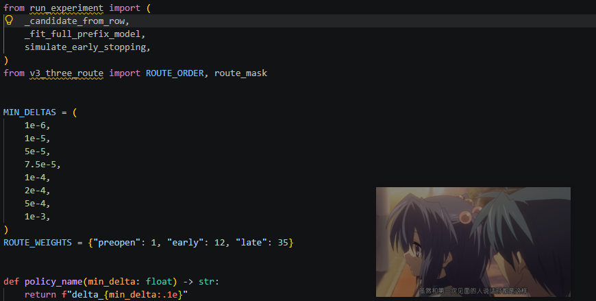

# 使用案例

编译器看番（×



# 灵动窗口控制器

一个独立的 Windows 窗口控制小工具，不修改、注入或依赖原有程序。

## 网页浏览和小说浏览等主要功能

- 将“拖到窗口”准星拖到浏览器或任意普通桌面窗口上完成选择。
- 以当前显示器可用面积的百分比自动计算窗口尺寸。
- 支持九宫格停靠、边距、16:9、4:3、21:9、1:1 和保持当前比例。
- 在整个虚拟桌面上用鼠标直接框选目标位置和大小。
- 手动输入 X、Y、宽和高，支持负坐标的多显示器布局。
- 设置目标窗口置顶、透明度、最小化和恢复。
- 自动识别 Edge、Chrome、Firefox 等浏览器创建的原生画中画窗口。
- 将画中画窗口按指定面积、比例、位置和边距自动停靠并置顶。
- 自动使用目标窗口所在显示器，并可避开任务栏。

## 哔哩哔哩视频使用

1. 运行 `bin\Release\WindowDockTool-v1.2.exe`。
2. 按住“拖到窗口”，将鼠标移到目标浏览器后松开。
3. 按 `Esc` 退出网页全屏。
4. 在视频画面上连续点击两次鼠标右键或看到视频上方悬浮点击 Edge 菜单的“画中画”。
5. 回到控制器点击绿色“定位画中画 → 右下角”，程序会自动识别、置顶并按默认面积 10% 停靠。
6. 此时拖动透明度则逻辑为调整小窗透明度。
也可以把“拖到窗口”准星直接拖到已经出现的画中画窗口，然后使用比例停靠或手动框选。

浏览器网页全屏的定义就是占满整块显示器，不能直接改变成右下角小区域。浏览器原生画中画会生成独立的视频窗口，才能稳定实现“只看视频画面、右下角小窗、始终置顶”。

“占面积 10%”是指窗口面积约为显示器可用面积的 10%，不是宽度和高度各为 10%。

## 本地构建

在 PowerShell 中运行：

```powershell
.\build.ps1
```

构建需要 Windows 自带的 .NET Framework 4.x C# 编译器。

源码位于 `src/WindowDockTool.cs`，构建结果输出到
`bin/Release/WindowDockTool-v1.2.exe`。

## 已知限制

- 只能控制与本工具权限级别相同或更低的窗口。管理员身份运行的目标程序，需要本工具也以管理员身份运行。
- 某些游戏、独占全屏程序、UWP 窗口或带特殊窗口管理机制的软件可能拒绝外部调整。
- 少数受 DRM 保护的网站可能禁止浏览器画中画。
- 不同网站可能提供自己的“小窗播放”，但建议使用浏览器右键菜单中的原生“画中画”，它会创建可由本工具控制的独立窗口。
